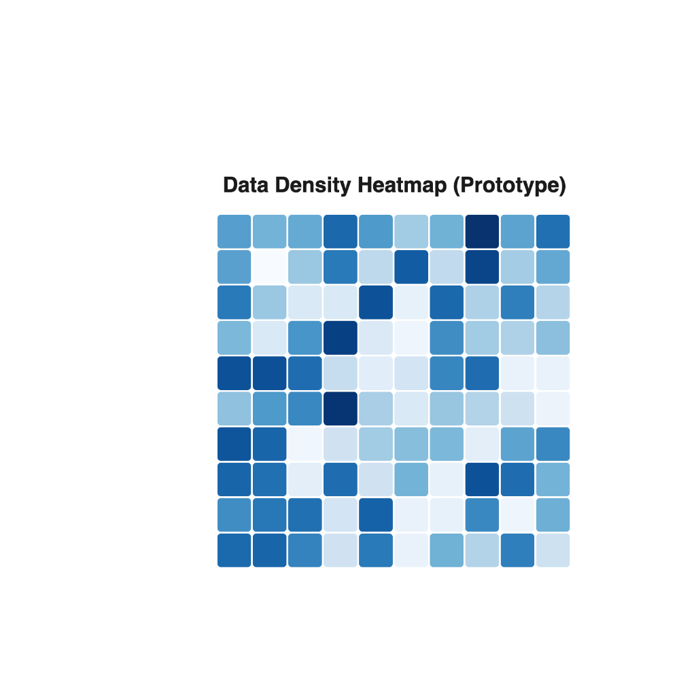

# Data Density Heatmap (GSoC Prototype)

This prototype serves to validate the foundational visualization approach for the **Data Density Heatmap** application, proposed for Google Summer of Code (GSoC) 2026 under the **Data for the Common Good** initiative.

## Screenshot

## Features

- **Heatmap Rendering:** Built natively with D3.js SVG elements for high-performance grid representation.
- **Density-Based Color Scaling:** Employs a continuous color scale (0–100%) to accurately illustrate data concentration.
- **Interactive Tooltip:** Provides dynamic, real-time data insights upon hover.
- **Sample Dataset Simulation:** Integrates randomized datasets to demonstrate immediate visualization capabilities.

## Tech Stack

- **React** – Component architecture and rendering structure
- **D3.js** – Data-driven SVG generation and color scaling

## Future Work

As part of the continuous evolution of this project, the following core features are slated for development:
- **GraphQL API Integration:** Connecting the frontend visualization seamlessly with robust backend data sources.
- **Dynamic Dataset Loading:** Allowing users to switch contexts and dynamically render new data layers.
- **Filtering & Sorting:** Interactive controls to manipulate and drill down into the active dataset matrix.
- **Export Functionality:** Empowering users to download visualizations and underlying data in CSV and PNG formats.
